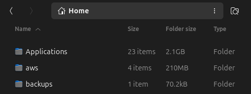

# Folder Size (GNOME Shell + Nautilus)

  

[English](README.md) | [Deutsch](README.de.md) | [Espanol](README.es.md)

Muestra el tamano de carpetas en la vista de lista y menus de Nautilus. La parte de GNOME Shell administra el hook de Python en Nautilus: al activar crea el symlink y al desactivar lo elimina.

## Requisitos
- GNOME Shell 45–48
- Nautilus con nautilus-python
- `du` en PATH (coreutils)

## Instalacion (usuario actual)
1) Copiar la carpeta a `~/.local/share/gnome-shell/extensions/foldersize@pappmann.com`.
2) Compilar esquemas: `glib-compile-schemas ~/.local/share/gnome-shell/extensions/foldersize@pappmann.com/schemas`.
3) Reiniciar GNOME Shell (Wayland: cerrar sesion; X11: Alt+F2, `r`).
4) Activar: `gnome-extensions enable foldersize@pappmann.com` o usar la app Extensions. Al activar se crea el symlink de Nautilus de forma automatica.
5) Reiniciar Nautilus: `nautilus -q`.

## Desactivar y eliminar
- Desactivar en Extensions o con `gnome-extensions disable foldersize@pappmann.com`. Esto borra el symlink de Nautilus y limpia `__pycache__`; reiniciar Nautilus para descargarlo.
- Para desinstalar: eliminar `~/.local/share/gnome-shell/extensions/foldersize@pappmann.com`.

## Traducciones
Ejecutar `make -C ~/.local/share/gnome-shell/extensions/foldersize@pappmann.com` para compilar `.po` a `.mo`.

## Actualizacion
Reemplazar el directorio, ejecutar `glib-compile-schemas`, reiniciar GNOME Shell y Nautilus.

## Notas
- Ajustes en el esquema GSettings `org.gnome.shell.extensions.foldersize`. Fallback: `~/.config/foldersize.conf`.
- El interruptor de Ajustes rápidos se puede ocultar en Preferencias (Mostrar interruptor de Ajustes rápidos) o desde el menú de extensiones de Nautilus.
- Si Nautilus sigue mostrando la extension tras desactivarla, ejecutar `nautilus -q`.
